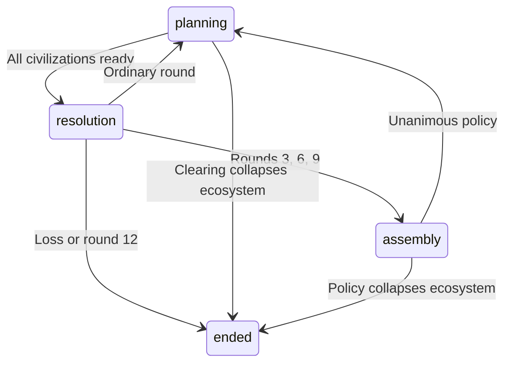

# Build Your Civ: cooperative strategy refactor

## Current architecture and audit

This repository is a bilingual classroom discussion game, not yet a numerical
simulation. The only numerical budgets are seven cards in each tree, four navigation
stages, reveal radius, and cosmetic settlement size. There are no stored resource
stocks, yields, upkeep, elapsed turns, global crises, shared projects or cross-team
trade. The useful foundation is already substantial:

- `shared/game.js`: content, event gates, prerequisites, immutable `applyAction`,
  initial team state and submission validation. The same reducer supports optimistic
  browser updates and authoritative server checks.
- `shared/land.js`: deterministic A–K geography, 37 axial hexes, six-neighbor lookup,
  terrain suitability, auto-placement and derived exploration.
- `public/hexmap.js`: SVG terrain, stylized fog, buildings, routes and event overlays.
- `public/student-view.js`, `public/app.js`: one board, tree drawers, guided questions,
  local pending-action replay and SSE synchronization.
- `server/store.js`: team JSON in SQLite, synchronous write transactions, per-team
  versions, sessions and activity logs. Reading a team calls `settleTiles`, which can
  reconstruct or relocate buildings.
- `server/http.js`: authenticated team actions and SSE; static files use an explicit
  whitelist. Neither team storage nor broadcasts currently model a common world.

The problem is weak consequences, rather than too many numeric stats. The classroom
explanation loop is useful; retain it around decisions that now have costs.

| Current variable/rule | Why choices have little friction | Concrete replacement |
| --- | --- | --- |
| `state.tech`, `state.civic`, seven-choice limit | Free toggles; removing cards removes descendants and releases buildings | Keep unlocked knowledge distinct from constructed districts; two civilization actions per round; pay materials to construct; unlocks stay known |
| `state.stage` (1–4), UI era track | Freely accessible sections appear to be chronological development | One fixed era; twelve shared rounds; four seasons of three rounds each; retain chapters only as UI sections |
| `state.tiles`, `settleTiles`, `place` | Automatic construction and unlimited free relocation erase commitment | Explicit tile selection, paid permanent construction, occupied tiles stay occupied; no move action |
| `fits`, `neighbours` | Terrain is mainly a yes/no placement condition | Show base yield, capped adjacency multiplier, biome specialization and shared-border bonus before committing |
| `revealRadius`, travel card count | Fog disappears as a side effect of collecting cards | Spend an action scouting a frontier; persist discoveries; reveal nodes once; redact hidden terrain at the server |
| `settlementSize` | Village/town/city grows with the number of cards | Show functional milestones and winter readiness; no ranking, score or cosmetic accumulation target |
| `events.origin`, `events.encounter` | Choices can be changed, reset later work and primarily unlock text/card branches | One-time paid choices with lasting land effects; forecast seasonal consequences; replace reserve/guard/defense flavor with stewardship and shared shelter |
| Drawn camp/road in `hexmap.js` | Neighbor and route are illustrative, with no second economy | Actual partner settlement and contiguous road/bridge/canal graph; finite shared capacity; outgoing goods leave stock |
| Independent `teams.state_json` | Cooperation only exists inside a team | One session aggregate for multiple civilizations, with a ready flag and action budget per civilization |
| `submissionGaps`, `submittedAt` | Completing five answers is the only finish | Shared win/loss after winter; keep a separate reflective submission, so survival does not lock out learning |

Keep the five short answers, A–K geography and bilingual UI. Avoid carrying military
tradition, forts, walls, empire or rival-camp threats into the new scenario. The new
engine contains no attacks, opponent scoring or competitive victory paths.

## Proposed 45-minute session

**Age of Rivers** takes place in one era. The communities must build and stock a
Winter Sanctuary while keeping everyone alive and the ecosystem capable of supporting
the next era. Completing the sanctuary early does not skip winter.

Target facilitation: five minutes to learn roles and read the board, twelve rounds
at about 2.5 minutes each, three two-minute assemblies, and four minutes of debrief.
That is a pacing target, not an implemented real-time timer. A teacher can eventually
set discussion deadlines and explicitly pass for an absent team; a countdown must
never silently spend another team's actions.

Every planning round asks players to choose two actions from scout, build, clear,
construct infrastructure, send supplies or contribute. Unspent actions expire when
their civilization commits. All civilizations commit before the common harvest.
Multiple students in a civilization share its action budget.

- Highland Keepers extract more materials on hills and cannot produce food.
- River Gardeners produce more food on river or watered plains and cannot produce
  materials. Their initial building materials are a finite construction reserve.
- Optional Woodland Custodians gain culture on forest sites and have ordinary food
  and materials production. The starter scenario supports two or three civilizations;
  the three-civilization balance still needs playtesting.

No civilization can erase its deficit just by accumulating the same district. The
prototype pools stone, timber and production into **materials** to keep the first
session teachable; splitting minerals from timber is a later balance decision.

Adjacent complementary terrain or structures multiply a district's base output:
`floor(base × (1 + 0.25 × min(3, matchingNeighbors)) × biomeAffinity)`. Each neighbor
counts once, even when it matches both categories. An active archive or shrine
adjacent to a foreign archive/shrine grants its owner +1 knowledge and +1 culture;
the partner's active district evaluates the reciprocal benefit. Each district gets
this shared bonus once, so a border cannot generate unbounded yields.

Clearing an unoccupied forest grants three materials immediately, spends an action,
permanently turns the tile into plains, and costs five ecosystem balance. Keeping
forests supports shared recovery and shrine/archives adjacency. The natural wonder
cannot be cleared. Built districts cannot be moved or refunded.

Shipments arrive during planning, cost an action, debit the source, and reserve every
edge on an explicit explored path. Roads and bridges carry four resource units per
edge per round; canals carry six, but the narrowest edge still limits the shipment.
Both directions consume the same capacity. Neutral infrastructure remains neutral
and everyone may use it. Infrastructure has a separate tile slot from districts.
Construction crews work within two hexes of home or extend their committed land;
the prototype does not yet require construction materials to be shipped to remote
building sites. Project contributions do require physical delivery.

The season rules are visible and deterministic:

| Season | Baseline pressure | Pressure from exploitation |
| --- | --- | --- |
| Spring Thaw, rounds 1–3 | Establish routes; normal harvest; food upkeep 1/community | Below 40 balance, floods close river/wetland tiles through the following round and damage owners' materials |
| Summer Abundance, rounds 4–6 | Normal harvest; food upkeep 1 | Below 25 balance, communities with exposed plains farms lose two stored food |
| Autumn Blight, rounds 7–9 | Food harvest -1 unless a storehouse exists; upkeep 1 | Industrial impact continues while teams stock winter supplies |
| Winter Freeze, rounds 10–12 | Food harvest halved; upkeep 2 | Need the completed refuge and at least 30 balance after the last resolution |

Each producing mine costs two balance per round; a workshop costs three. Forests
restore one balance per three remaining forest tiles, capped at two per round.
Balance stays between zero and 100. A food shortfall reduces a community's health
by one; health starts at three. Zero health for any community or zero balance is a
shared loss. These values are a testable first balance, not validated classroom tuning.
Soil exhaustion, drought regions beyond exposed farms, and seasonal route maintenance
are future scenario modules, rather than hidden rules in this implementation.

Use the **Assembly of Elders** as governance, with a concrete tradeoff rather than a
random event popup. After rounds 3, 6 and 9, civilizations agree on one policy:
conserve restores eight balance but allows one action next round; mobilize costs six
balance but grants three actions next round. Voting is unanimous and votes can be
revised until agreement. No additional action timer is applied to the assembly.
Human facilitation must resolve deadlock; there is no automatic majority override.

| Great Work milestone | Delivered cost | Deadline | Cooperation requirement |
| --- | --- | --- | --- |
| Shared refuge foundations | 10 materials | End of round 5 | At least two actual donors |
| Living archive | 6 knowledge, 4 culture | End of round 9 | At least two actual donors |
| Winter reserves | 10 food, 4 materials | End of round 12 | At least two actual donors |

Only the current milestone accepts resources. Donations cannot overfill or spill
into the next milestone. A sole donor cannot deliver the last required unit and lock
everyone else out. Every civilization must appear in at least one completed milestone
for the final shared win. No player can win individually.

The answer to “can this civilization develop further?” is collective: at the end of
round twelve the sanctuary is complete, every community is alive and has contributed,
and balance is at least thirty. If any condition fails, the group receives a shared
ending explaining the missed survival or construction condition. There is no playable
second era during this session.

## Implemented state and modules

The new engine is separate from legacy team state. `shared/strategy/types.d.ts`
contains concrete Tile, AdjacencyYield, SeasonClock, PlayerState, GreatWork,
LogisticsPipe, SessionState, SessionView and discriminated SessionAction contracts.
`shared/strategy/index.d.ts` provides typed public function signatures. The runtime
remains plain ES modules with zero added dependencies.

| Module | Responsibility |
| --- | --- |
| `resources.js` | Four-resource vectors; integer validation; checked spend/add |
| `hex.js` | Axial neighbors, deterministic 61-tile board, terrain/structure data, biome and adjacency calculations |
| `logistics.js` | Path search and authoritative route validation; undirected edge capacity |
| `great-work.js` | Partial deliveries, distinct donors, stage history and deadlines |
| `turn-manager.js` | Session creation, revision-checked immutable actions, unanimous readiness, harvest/crises, assemblies and shared outcome |
| `index.js` | Public engine entrypoint |
| `scripts/cooperative-demo.js` | Full legal twelve-round example, including trading and milestone deliveries |
| `tests/strategy.test.js` | Core rules, rollback, stale devices, fog privacy, logistics, loss states and complete-session checks |

The transition graph is:



Resolution is a synchronous transient phase inside the reducer. There is no async
work between readiness and settlement, and the returned state never remains half
resolved. The season and round advance together after resolution or policy agreement.
Income is generated at round end and becomes available during the following planning
phase. Shipments consume existing stocks during planning, so this turn's expected
harvest cannot be spent early.

Minimal use:

```js
import { createSession, applySessionAction, findRoute } from './shared/strategy/index.js';

let session = createSession();
session = applySessionAction(session, {
  actorId: 'highland', expectedRevision: session.revision,
  type: 'scout', tileId: '0,0'
});
session = applySessionAction(session, {
  actorId: 'highland', expectedRevision: session.revision,
  type: 'infrastructure', tileId: '-1,0', infrastructure: 'road'
});
session = applySessionAction(session, {
  actorId: 'highland', expectedRevision: session.revision, type: 'ready'
});
// The round has not advanced: river must commit too. After the corridor is
// completed in later turns, findRoute previews a valid delivery path.
```

Run `npm run demo:coop`. The sample delivers milestones in rounds 4, 6 and 9,
survives through round 12 at full health and ends with 96 balance. It demonstrates
feasibility, not strategic variety or a guaranteed 45-minute session.

## Four-step refactoring roadmap

1. **Extract and verify the rules without replacing classroom state.** This change
   implements `shared/strategy/*`, contracts, tests and `demo:coop`. Keep
   `shared/game.js`, `shared/land.js` and existing saved teams untouched. Do not feed
   committed strategy tiles through `settleTiles`; its load-time auto-placement
   would violate permanence. Keep the old 35 tests and run `npm test` after changes.
   Acceptance: the legal demo wins; idle teams lose; broken paths cannot deliver.

2. **Persist one session and expose authenticated cooperative actions.** In
   `server/store.js`, add `game_sessions(id, mode, schema_version, state_json,
   revision)` and a `session_teams(session_id, team_id, civilization_id)` membership
   table. Use an additive migration; old team JSON and submissions stay intact.
   Add `updateGameSession` with the existing synchronous `BEGIN IMMEDIATE` pattern:
   load session, derive actor from membership, compare expected revision, call the
   engine, store aggregate state and log atomically. In `server/http.js`, add
   cooperative GET/action endpoints and session-level SSE, broadcasting a separate
   `sessionView` for each civilization. Never trust a client-supplied actor ID. Return
   a fresh view plus HTTP 409 for stale revisions. Retry user intent after refresh,
   rather than replaying a ready flag against a new round. Add new module paths to
   the static whitelist. Acceptance: simultaneous devices cannot double spend;
   another civilization cannot write your actions; a restart preserves the clock;
   fog is absent from network payloads, not just hidden by SVG.

3. **Connect the shared board and commitment previews.** In `public/app.js`, maintain
   a separate session model selected by server `mode`; retain the legacy path.
   Expand structural update detection to session revisions, board, work, phase and
   logistics. Disable controls when the team is ready or actions are exhausted;
   show a deliberate End Turn control. In `public/hexmap.js`, render session axial
   coordinates directly, showing fogged view tiles without reading hidden terrain.
   In `public/student-view.js`, replace era navigation for this mode with fixed-era
   season/round labels, costs, stock/upkeep, crisis forecast, route capacity, partner
   needs, milestone deadline and adjacency preview. Replace move controls with
   build/scout/route controls. Add all strings to `shared/i18n.js` with locale parity.
   Acceptance: a player can see “clearing buys this road now but loses this forest
   bonus and five balance” before committing, and complete a session in the UI.

4. **Playtest and polish the full classroom loop.** Update `public/prompts.js` to
   reference actual trades, irreversible land changes and missed/shared milestones.
   Show shared endings and allow teacher reflection submissions after either
   outcome. Add bilingual assembly and readiness UI, touch/keyboard hex controls,
   reduced-motion seasonal feedback, and visible waiting/connection status. Extend
   `tests/server.test.js` with multi-civilization SSE, reload, stale-action and hidden
   tile tests before removing any legacy code. Playtest two and three civilizations
   for 45-minute pacing, meaningful alternative plans and recoverable shortages.
   Scale to A–K classrooms by using multiple small cooperative tables or a separately
   balanced larger scenario, not eleven communities on the starter map. Acceptance:
   success needs trade and spatial planning, every civilization acts each round,
   and both victory and failure produce a useful four-minute debrief.

This patch completes step 1. Persistence, browser controls, localization and classroom
pacing remain explicit integration work; `npm start` still opens the original game.
