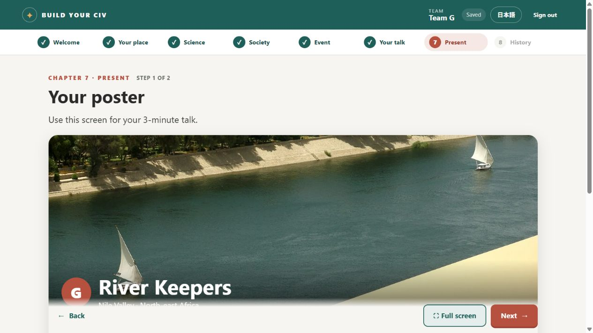

# Implementation verification — 2026-10-01

The point-budget classroom game is implemented and verified. Claude's existing work was retained and completed; the retired hex-map and cooperative interfaces are no longer served.

## Automated checks

- `npm test`: **75 passed, 0 failed**.
- Rules cover prerequisites, seven-point budgets, free/impossible/hard cards, stored dice reuse, all six events, pre-event reconstruction, mandatory event resolution, required choices, and immutable inputs.
- Client checks cover rapid queued choices without stale versions, failed saves blocking navigation, draft retention, responses from previous logins, teammate dice conflicts, failed-roll recovery, and animation races.
- HTTP integration includes a 30-student session, atomic dice and rollback, migration, checkpointed backup integrity, reconnect state, presence, reveal, submission/reopening, logout, and removed routes.
- Content checks cover both languages, furigana, glossary entries, every displayed photo, and credit-manifest consistency.

## Browser verification

Browser checks used a separate temporary SQLite directory and a deterministic test die. They did not use the saved classroom database in the workspace.

Completed the student flow for Team G: introductions and region cards; prerequisite picks; Horseback Riding's saved result; science/society reviews; Newcomers; Trade selection followed by a separate final confirmation; a mandatory free Foreign Trade gain; all seven answers entered with keystrokes; required government/economy/belief choices; final review; submission; and the presentation poster. The government Next button stayed disabled when only its explanation was filled.

The waiting screen received the teacher's reveal toggle live. Historical content and Japanese rendering opened successfully. Closing the reveal returned the student to the waiting screen. The teacher dashboard showed submitted progress and the optional region selector.

An additional browser test-team creation was blocked by automatic approval review because it treated creation as a persistent application change. That browser action was left blocked. Fixed-region creation is covered by the passing integration test in its separate disposable database.

## Remaining content assumption

Only G's ★ Irrigation, ★ Sailing, and △ Horseback prices are supplied by slide 18. The other ten regional tables and their geography explanations were already authored in the implementation. Their values were preserved and their provenance is documented in `shared/regions.js` and the README for instructor review.

The Foreign Trade-line interpretation and partly-working Trade's epidemic/soil asymmetry follow the pasted design. Old belief answers are retained; other old answers remain visible to teachers as legacy work. Existing submitted teams remain locked until reopened.

## Running and saved data

Run `npm run dev` with Node.js 24 or newer. Configure a private `TEACHER_PASSWORD` for classroom use; the README describes production and storage settings.

When an older database is opened, the server checkpoints and creates a consistent SQLite backup plus its secret under `data/backups/pre-v2-<timestamp>-<suffix>/` before updating the old schema or state. Retired world tables are preserved. Keep regular backups of the full data directory as well.
